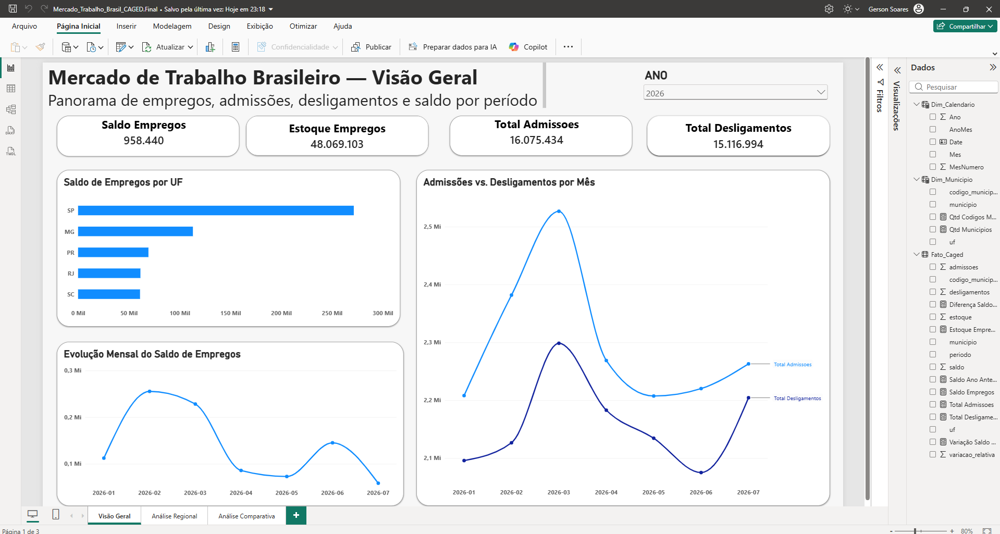
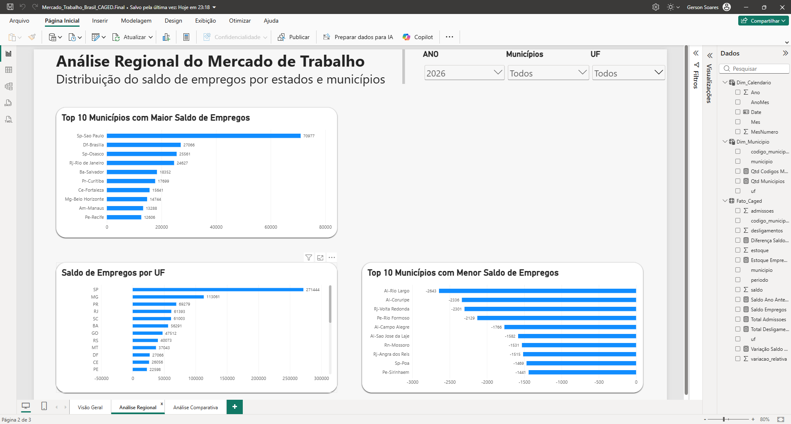
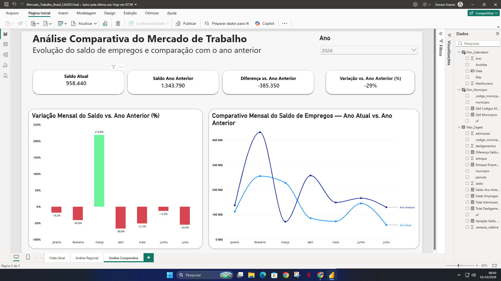

# 📊 Mercado de Trabalho Brasileiro — CAGED

Dashboard desenvolvido em **Power BI** para análise do mercado de trabalho formal brasileiro a partir de dados do **CAGED**, permitindo acompanhar admissões, desligamentos, saldo de empregos e a evolução dos indicadores ao longo do tempo.

## 🎯 Objetivo do Projeto

O objetivo deste projeto é transformar dados do mercado de trabalho em informações visuais que facilitem a identificação de tendências, diferenças regionais e variações do saldo de empregos.

O dashboard permite analisar:

- Saldo de empregos
- Total de admissões
- Total de desligamentos
- Estoque de empregos
- Evolução mensal do saldo
- Distribuição do saldo por UF
- Municípios com maiores e menores saldos
- Comparação do saldo com o ano anterior
- Variação percentual mensal

## 🛠️ Tecnologias Utilizadas

- Power BI Desktop
- Power Query
- DAX
- Modelagem de dados
- Inteligência de tempo
- Git e GitHub

## 🗂️ Estrutura do Dashboard

O relatório foi dividido em três páginas principais:

### 1. Visão Geral

Apresenta os principais indicadores do mercado de trabalho e sua evolução ao longo do período selecionado.

### 2. Análise Regional

Permite analisar a distribuição do saldo de empregos por estados e municípios, incluindo os municípios com maiores e menores saldos.

### 3. Análise Comparativa

Compara o desempenho do período atual com o ano anterior, utilizando indicadores absolutos e percentuais.

## 📈 Principais Indicadores

Entre os indicadores utilizados no dashboard estão:

- Saldo de Empregos
- Estoque de Empregos
- Total de Admissões
- Total de Desligamentos
- Saldo do Ano Anterior
- Diferença vs. Ano Anterior
- Variação vs. Ano Anterior (%)

## 🧮 Análises Desenvolvidas

O projeto utiliza medidas em **DAX** para realizar cálculos dinâmicos de acordo com os filtros selecionados.

Foram implementadas análises como:

- Comparação entre ano atual e ano anterior
- Variação percentual do saldo
- Evolução mensal dos indicadores
- Ranking de municípios
- Análise por Unidade Federativa
- Formatação condicional para destacar resultados positivos e negativos

Também foi utilizada uma **tabela calendário** para suportar as análises temporais e a comparação entre diferentes períodos.

## 🔎 Recursos Interativos

O dashboard possui filtros para permitir análises por:

- Ano
- Unidade Federativa (UF)
- Município

Os indicadores e gráficos respondem dinamicamente às seleções realizadas pelo usuário.

## 📁 Arquivos do Projeto

O repositório contém:

- Arquivo `.pbix` com o dashboard completo
- Capturas das três páginas do relatório
- Documentação do projeto neste README

## 👤 Autor

**Gerson Soares**

Projeto desenvolvido como parte do meu portfólio de **Análise de Dados**, aplicando conceitos de tratamento, modelagem, análise e visualização de dados com Power BI.
